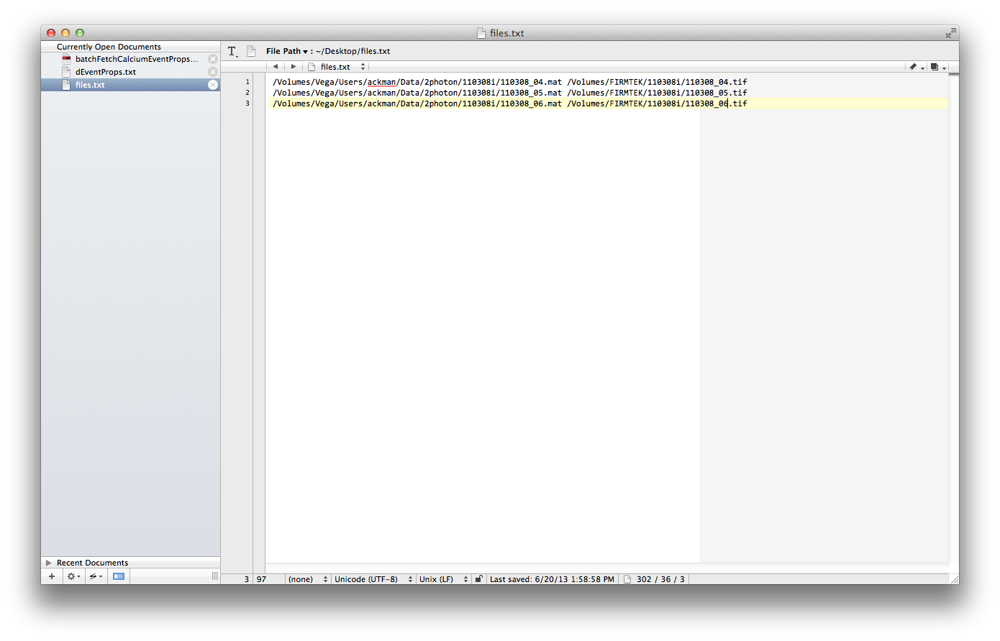
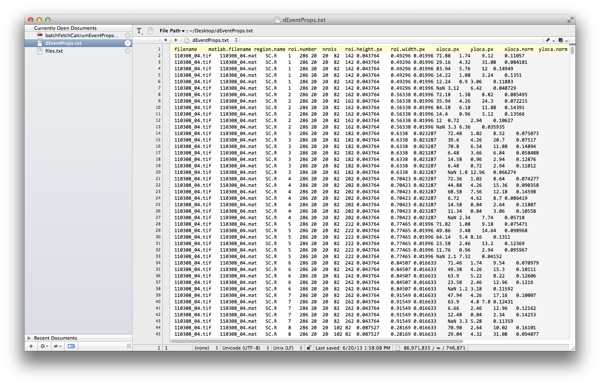

Author: James B. Ackman  
Date: 2012-11-19  
Comments: Updated 2012-12-04, 2013-06-20 13:51:07  
Tags: manual, doc, protocols, methods  

# Fetching Calcium event properties #
The purpose of this documentation is to demonstrated how to fetch calcium event properties from calciumdx-calciumdxevents analyzed .mat files. 

A script called *batchFetchCalciumEventProps.m* will be used to extract an event based dataset of calcium transient amplitudes, durations, rise times, intervals, and ROI calcium event frequencies, normalized xy coordinates of the ROIs, and region location information.

## Preparation ##
* Make a text file with a list of full pathnames to the location of all your .mat files you want to extract data from. e.g. *files.txt*.
	**Hint 1:** Try not to have spaces in your filenames. **Hint 2:** To easily get the full path name, simply drag and drop you .mat file onto the command line at the Mac OS X Terminal window. Then copy this filename into a new line in a text editor (like [TextWrangler](http://www.barebones.com/products/textwrangler/)).

* Place this text file into your calciumdxevents folder. e.g. */Users/username/Documents/MATLAB/CalciumDX/CalciumDXevents/files.txt*
* Start MATLAB

## Import file name list ##
Now we will import that list of filenames into MATLAB and set it to a cell array variable called *filelist*

* Set your working directory in your MATLAB session to your calciumdxevents folder.
* Run the following command in MATLAB:  
	`filelist = readtext('files.txt',' ');`

## Running the batch code ##
Now we will run the batchFetch script, which will automatically save the extracted dataset for all your files in a space-delimited text file called *dEventProps.txt*. **Hint:** This is one reason why it is important not to have spaces in your filename or any other text variables. 

**Important!** Make sure you back up to a separate location any previous copies of *dEventProps.txt* in your calciumdxevents folder-- each new time this batchFetch script runs it will append new data to this text file.

* Run the following command in MATLAB:
	`batchFetchCalciumEventProps(filelist);`
	
Alternatively you can load an existing .mat file into your workspace and create a variable for your filename:

	filename = /pathnameForMyData/filenameForMyData.mat
* And then run the following command:
	`batchFetchCalciumEventProps({filename},region);`

Here is what the resulting data file *dEventProps.txt* will look like.

This txt data file can then be read into your favorite [statistical analysis environment](http://www.rstudio.com/) for data visualization and exploration.
